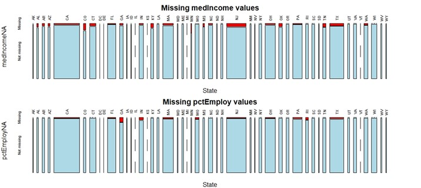
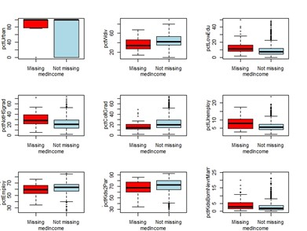
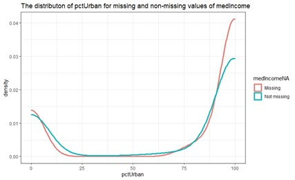

```{r setup, include=FALSE}
knitr::opts_chunk$set(echo = TRUE)
library(dplyr)
library(tidyr)
library(ggplot2)
library(lmtest)
library(grid)
library(corrplot)
```


# Executive summary


# Key findings

1. The highly correlated pairs of variables are:
  + **`medIncome`** and **`pctWdiv`**, with correlation coefficient of 0.75
  + **`pctUnemployed`** and **`pctEmploy`**, with correlation coefficient of 0.67
  + **`pctKids2Par`** and **`pctKidsBornNevrMarr`**, with correlation coefficient of 0.86
  
2. The highly correlated cluster of variables are:
  + **`pctLowEdu`**, **`pctNotHSgrad`** and **`pctCollGrad`**, with average correlation coefficient of 0.75
  + **`ownHouseMed`**, **`ownHousQrange`** and **`rentMed`**. with average correlation coefficeint of 0.79
  
  
  
  
  
 
 
 
 
 
 
 
 
 
# Statistical Methodology 

```{r include=FALSE}
load("USACrime.Rda")
df=USACrime
```

To see which variables are significantly associated with the outcome variables, we will conduct hypothesis tests (see appendix 1.1) on each of the variables. The hypotheses are the following: 


$$H_0: \text{corr}(x_i,y_j)=0, H_1: \text{corr}(x_i,y_j)\neq 0 , i=1,...,20, j=1,2$$

We explain $i$ ranging in the interval $1$ to $20$ due to there being $24$ variables, out of which $2$ are factor variables and $2$ are target variables.  
  
  
We observe that `violentPerPop` and `nonViolPepPop` have very stronger than average correlation $(\gt 0.40)$ with the variables `pctKids2Par` (corr $\in \{-0.73,-0.67\}$ with variables `violentPepPop` and `nonViolPerPop` respectively), `pctKidsBornNevrMarr` (corr $\in \{0.74,0.55\}$), `pctWdiv` (corr $\in \{-.56,-0.49\}$), `pctNotHSgrad` (corr $\in \{0.47,0.37\}$), `pctUnemploy` (corr $\in\{0.47,0.39\}$), `pctHouseOwnerOccup` (corr $\in\{-0.46,-0.46\}$), `pctVacantBoarded` (corr $\in \{0.48,0.32\}$), `medIncome`
(corr $\in\{0.39,0.46\}$).   
  
## Can the relationship be characterized as a linear?

Below you can see the scatterplots of every variable plotted against the dependent variables. 

```{r echo=FALSE, message=FALSE, warning=FALSE,fig.width=10,fig.height=5}
multiplot <- function(..., plotlist=NULL, cols) {
    
    # Make a list from the ... arguments and plotlist
    plots <- c(list(...), plotlist)
    numPlots = length(plots)
    # Make the panel
    plotCols = cols                          # Number of columns of plots
    plotRows = ceiling(numPlots/plotCols) # Number of rows needed, calculated from # of cols
    # Set up the page
    grid.newpage()
    pushViewport(viewport(layout = grid.layout(plotRows, plotCols)))
    vplayout <- function(x, y)
        viewport(layout.pos.row = x, layout.pos.col = y)
    # Make each plot, in the correct location
    for (i in 1:numPlots) {
        curRow = ceiling(i/plotCols)
        curCol = (i-1) %% plotCols + 1
        print(plots[[i]], vp = vplayout(curRow, curCol ))
    }
}
df1=df[,c(4,5,7,9,11,12,14,15,23,24)]
plot1=df1 %>%
  gather(-nonViolPerPop, key = "var", value = "value") %>%
  ggplot(aes(x = value, y = nonViolPerPop)) +
    geom_point() +
    facet_wrap(~ var, scales = "free") +
    theme_bw()+geom_smooth()
plot2=df1 %>%
  gather(-violentPerPop, key = "var", value = "value") %>%
  ggplot(aes(x = value, y = violentPerPop)) +
    geom_point() +
    facet_wrap(~ var, scales = "free") +
    theme_bw()+geom_smooth()
multiplot(plot1,plot2,cols=2)
```
From the scatter plots it is evident that the relationships are not linear. However, to confirm this hypothesis, we compare whether a non-linear model would be a better fit through an ANOVA test. Оur results indeed confirm that every variable has a non linear relationship with the dependent variables (see appendix 1.2).
  
## Does the relationship appear to be homoscedastic?

From the scatterplots above we see that the relationships are heteroscedastic. We test our hypothesis with the Breusch-Pagan test and indeed the relationships are hetersocedastic (see appendix 1.3).

We applied log transformations to the independent variables, but it did not resolve the issue where the relationship is heteroscedastic.Although our attempts didn't solve the issues, ther are other approaches include performing the Box-Cox transformation as well fitting a model that accounts for changes in variance.
  
  
  
  
  
  
  
  
  
  
  
  
  
  2) Which variables, if any, have a highly skewed distribution? What transformations might be
  applied to reduce skewness and stabilize the spread of the observations?
  
## Question: Do any of the variables have outlying values? How should outliers be treated?

The outlying values are unusually the large or small values that fall beyond the overall pattern.

To look at the outliers of the variables, we will choose function "boxplots" and focus on the points lying outside the box pattern.

For example, we first draw the boxplot of the variable "pctNotHSgrad".

```{r echo=FALSE}
library(ggplot2)
ggplot(df, aes( y=pctNotHSgrad)) + 
geom_boxplot(aes(fill = "red"))
```

After drawing the boxplot, we observe that there are about 14 dark points fell beyond the overall pink pattern. 

From the boxplots of all univariate variables, it is clear that varirables "medIncome", "pctWdiv", "pctLowEdu", "pctNotHSgrad", "pctCollGrad", "pctUnemploy", "pctEmploy", "pctKids2Par", "pctKidsBornNevrMarr", "pctHousOccup", "pctHousOwnerOccup", "pctVacantBoarded", "pctVacant6up", "ownHousMed ", "ownHousQrange", "rentMed", "rentQrange", "popDensity", "pctForeignBorn", "violentPerPop" and "nonViolPerPop" have outlying values.


```{r echo=FALSE, fig.width=7}
ggplot(df, aes(x = State, y = violentPerPop ))+ 
geom_boxplot(aes(fill = State))
```

We could have a look at the outlying values of the violence per population in every state. Here it is very clear that all outlying values are appeared as dark points out of the colourful patterns.

Another example of outlying values in bivariate variables plot.

```{r echo=FALSE}
x <- lm(df$violentPerPop~ df$pctNotHSgrad)
plot(df$violentPerPop~ df$pctNotHSgrad ,main="violentPerPop versus pctNotHSgrad",col="blue")
abline(x, col = "red")
```

We will particularly look at points with large distance from the red line.

We will check for a data entry error firstly and then examine the physical context.
We might need to pay attention to these outlying values when we fit a model: exclude the point from the analysis but try including it later to see if the model is changed. At this stage, we prefer to keep these outlying values. A single point won’t have the leverage to affect the fit very much. It’s still worth identifying outliers if these type of points are worth knowing about in the particular application. We only need to care about cluster of outliers which may hide each other.  

# Correlation between explanatory variables

To investigate the correlation between all explanatory variables, we first plot a correlation matrix with all explanatory variables included (see appendix 2.1).

However, a correlation matrix with 20 variables is difficult to look at. We can remove variables that have low correlation with all other variables, that are variables that have absolute value of correlation coefficient of less than or equal to 0.65 with all other variables, to remove some variables out of the discussion. 

We are then left with the following correlation matrix:

```{r figs, echo=FALSE, fig.width=5,fig.height=4,fig.cap="\\label{fig:figs}Correlation Matrix for selected explanatory variables"}
USACrimeCorrelation <- subset(USACrime,select=-c(State,region,violentPerPop,nonViolPerPop,pctUrban,pctHousOccup,pctHousOwnerOccup,pctVacantBoarded,pctVacant6up,popDensity,pctForeignBorn))
Correlation <- cor(USACrimeCorrelation, use="pairwise.complete.obs")
pvaluematrix <- cor.mtest(USACrimeCorrelation)$p
col <- colorRampPalette(c("#BB4444", "#EE9988", "#FFFFFF", "#77AADD", "#4477AA"))
corrplot(Correlation, method = "color", col = col(200),
         type = "lower", number.cex = 0.5, 
         addCoef.col = "black", tl.cex = 0.6,
         tl.col = "black", tl.srt = 90, 
         p.mat = pvaluematrix, sig.level = 0.01, insig = "blank", 
         diag = FALSE)
```

Using this correlation matrix, we are able to identify pairs or clusters of explanatory variables that are highly correlated to each other. Then we can pick one that best represents the pair/cluster and remove the rest during model building. During this part of the investigation, we would assume that two variables are highly correlated if the absolute value for their correlation coefficient is larger than 0.65.

1. The first pair of highly correlated variables is 
  + **`medIncome`**, median household income
  + **`pctWdiv`**, percentage of households with investment/rent income
  
|       Both variables measures how wealthy people are in the community. Hence, we recommend using **`medIncome`** as the only wealth measuring variable.
\

2. The second cluster of highly correlated variables is
  + **`pctLowEdu`**, percentage of people 25 and over with less than a 9th grade education
  + **`pctNotHSgrad`**, percentage of people 25 and over that are not high school graduates
  + **`pctCollGrad`**,percentage of people 25 and over with a bachelors degree or higher education
  
|       All three variables measures the education level of the people in the community. Hence, we recommend using **`pctLowEdu`** as the only education measuring variable.
\

3. The third pair of highly correlated variables is
  + **`pctUnemployed`**, percentage of people 16 and over, in the labor force, and unemployed
  + **`pctEmploy`**, percentage of people 16 and over who are employed

|       Both variables measures the employability of the people in the community. Hence, we recommend using **`pctUnemployed`** as the only employment measuring variable.
\


4. The forth pair of highly correlated variables is 
  + **`pctKids2Par`**, percentage of kids in family housing with two parents
  + **`pctKidsBornNevrMarr`**, percentage of kids born to never married
  
|       Both variables measures the completeness of family of the people in the community. Hence, we recommend using **`pctKids2Par`** as the only completeness of family measuring variable.
\

5. The last cluster of highly correlated variables is
  + **`ownHouseMed`**, owner occupied housing - median value
  + **`ownHousQrange`**, owner occupied housing - difference between upper quartile and lower quartile values
  + **`rentMed`**, rental housing - median rent

|       All three variables measures the cost of living(housing) for the people in the community. Hence, we recommend using **`ownHouseMed`** as the only completeness of family measuring variable.

In the end, we recommend using these remaining variables for model building purposes.


## Missing data

There are 73 missing records in the dataset, 52 missing values within variable **`medIncome`** and 21 missing values within **“pctEmploy”**. This is a cause for concern when fitting a model for the dependent variables. Data which is MAR or MNAR risks fitting a model which does not consider sufficient data from a subgroup of the dataset, whether that data is missing because of variables directly related to the data or otherwise. 
There is no indication that a particular region or state had significantly more missing values than any other when considering either of the two variables with missing values, see Figure 1. A similar mosaic plot for “regions” is produced (s. The plot shows a small number of missing values shared roughly equally across regions. 

{#id .class width=50 height=30cm}


To consider the type of missing values, boxplots for all independent USACrime variables were produced. These plots compare each dependent variable’s observations when the observations are classified as missing or non-missing with regards to its “medIncome” and “pctEmploy” record.




In the plot above, we compare the distribution of 9 out of 19 independent variables to “medIncome”. Apart from the box plot of “medIncome” against “pctUrban”, all boxplots show a similar distribution for each variable regardless of whether “medIncome” was recognised as missing or non-missing. For “pctUrban” the boxplot does not sufficiently show that the distributions are similar.


However, a density plot of “pctUrban” against “medIncome”’s missing and non-missing values does confirm there is similarity between distributions, see the plot below.




# Appendix


# 1

### Importing libraries

```{r}
library(dplyr)
library(tidyr)
library(ggplot2)
library(lmtest)
```

### Importing the data

```{r}
load("USACrime.Rda")
df=USACrime
```

## 1.1

### Which variables show a strong relationship with the outcome variables?


To see which variables are significantly associated with the outcome variables, we will conduct hypothesis tests on each of the variables. The hypotheses are the following: 


$$H_0: \text{corr}(x_i,y_j)=0, H_1: \text{corr}(x_i,y_j)\neq 0 , i=1,...,20, j=1,2$$

We explain $i$ ranging in the interval $1$ to $20$ due to there being $24$ variables, out of which $2$ are factor variables and $2$ are target variables.

You will now see the pearson correlation coefficients with their respective p-values for the relationships between the explanatory variables and `violentPerPop`:

```{r}
# Subsetting the dataframe so that it excludes State, region and violentPerPop
dfcor1 <- subset(df, select = -c(State, region, violentPerPop,nonViolPerPop))
# Looping through all explanatory variables
for(i in colnames(dfcor1)){
  test=cor.test(dfcor1[[i]],df$violentPerPop)
 cat(sprintf("%s: p-value: %s, and correlation coefficient estimate: %s \n",i, test$p.value,round(test$estimate,digits = 2)))}
```

We will now examine the relationship between `nonViolPerPop` and the other variables:

```{r}
# Looping through all explanatory variables
for(i in colnames(dfcor1)){
  test=cor.test(dfcor1[[i]],df$nonViolPerPop)
 cat(sprintf("%s: p-value: %s, and correlation coefficient estimate: %s \n",i, test$p.value,round(test$estimate,digits = 2)))}
```
We observe very strong correlation with the variables `pctKids2Par`, `pctKidsBornNevrMarr`, `pctWdiv`,`pctNotHSgrad`,`pctUnemploy`, `pctHousOwnerOccup`, `pctVacantBoarded`,`medIncome`.


# 1.2

### Can the relationship be characterized as a linear?

We will plot the variables `pctKids2Par`, `pctKidsBornNevrMarr`, `nonViolPerPop` and `violentPerPop` visualizing them in scatterplots:

```{r include=FALSE}
library(grid)
multiplot <- function(..., plotlist=NULL, cols) {
    
    # Make a list from the ... arguments and plotlist
    plots <- c(list(...), plotlist)
    numPlots = length(plots)
    # Make the panel
    plotCols = cols                          # Number of columns of plots
    plotRows = ceiling(numPlots/plotCols) # Number of rows needed, calculated from # of cols
    # Set up the page
    grid.newpage()
    pushViewport(viewport(layout = grid.layout(plotRows, plotCols)))
    vplayout <- function(x, y)
        viewport(layout.pos.row = x, layout.pos.col = y)
    # Make each plot, in the correct location
    for (i in 1:numPlots) {
        curRow = ceiling(i/plotCols)
        curCol = (i-1) %% plotCols + 1
        print(plots[[i]], vp = vplayout(curRow, curCol ))
    }
}
```


```{r message=FALSE, warning=FALSE,fig.width=10,fig.height=10}
library(dplyr)
df1=df[,c(4,5,7,9,11,12,14,15,23,24)]
plot1=df1 %>%
  gather(-nonViolPerPop, key = "var", value = "value") %>%
  ggplot(aes(x = value, y = nonViolPerPop)) +
    geom_point() +
    facet_wrap(~ var, scales = "free") +
    theme_bw()+geom_smooth()
plot2=df1 %>%
  gather(-violentPerPop, key = "var", value = "value") %>%
  ggplot(aes(x = value, y = violentPerPop)) +
    geom_point() +
    facet_wrap(~ var, scales = "free") +
    theme_bw()+geom_smooth()
multiplot(plot1,plot2,cols=2)
```


We can see from the plots that there is a possibility that `pctKids2Par` may have a linear relationship with `nonViolPerPop`, and that `pctKidsBornNevrMarr` may have a linear relationship with `violentPerPop`. The other variables from first sights don't have a linear relationship, nonetheless we will test for each variable.

To see whether we can classify the relationship between these variables as linear, we can fit a linear and nonlinear model and asses whether the nonlinear model explains a significantly larger amount of variance. These tests will be done via `ANOVA` function.

We will now test whether the variable `pctKidsBornNevrMarr` performs better with a linear or nonlinear model when modeling for `violentPerPop`:

```{r}
linModel=lm(df$violentPerPop~df$pctKidsBornNevrMarr)
sqModel=lm(df$violentPerPop~poly(df$pctKidsBornNevrMarr,2))
anova(linModel,sqModel)
```

We can see that the p-value$=2.223e-06 \lt 0.001$. So having a non-linear model fitted for the variables `violentPerPop` and `pctKidsBornNevrMarr` did lead to a significantly improved fit over the linear model. 

We now fit the same models for the variables `pctKidsBornNevrMarr` and `nonViolPerPop`:

```{r}
linModel=lm(df$nonViolPerPop~df$pctKidsBornNevrMarr)
sqModel=lm(df$nonViolPerPop~poly(df$pctKidsBornNevrMarr,2))
anova(linModel,sqModel)
```
We again see that the non-linear model leads to a significantly improved fit over the linear model.

We now test for the variables `pctKids2Par` and `nonViolPerPop`:

```{r}
linModel=lm(df$nonViolPerPop~df$pctKids2Par)
sqModel=lm(df$nonViolPerPop~poly(df$pctKids2Par,5))
anova(linModel,sqModel)
```
The non-linear model provides a significant improvement in fit.

And lastly we test the variables `pctKids2Par` and `violentPerPop`:

```{r}
linModel=lm(df$violentPerPop~df$pctKids2Par)
sqModel=lm(df$violentPerPop~poly(df$pctKids2Par,2))
anova(linModel,sqModel)
```
The non-linear model provides a significant improvement in fit.

We now test for the variables `medIncome` and `violentPerPop`:

```{r}
dff=na.omit(df)
linModel=lm(dff$violentPerPop~dff$medIncome)
sqModel=lm(dff$violentPerPop~poly(dff$medIncome,2))
anova(linModel,sqModel)
```
The non-linear model provides a significant improvement in fit.


We now test for the variables `medIncome` and `nonViolPerPop`:

```{r}
dff=na.omit(df)
linModel=lm(dff$nonViolPerPop~dff$medIncome)
sqModel=lm(dff$nonViolPerPop~poly(dff$medIncome,2))
anova(linModel,sqModel)
```
The non-linear model provides a significant improvement in fit.

And lastly we test the variables `pctWdiv` and `violentPerPop`:

```{r}
linModel=lm(df$violentPerPop~df$pctWdiv)
sqModel=lm(df$violentPerPop~poly(df$pctWdiv,2))
anova(linModel,sqModel)
```
The non-linear model provides a significant improvement in fit.

We now test for the variables `pctWdiv` and `nonViolPerPop`:

```{r}
linModel=lm(df$nonViolPerPop~df$pctWdiv)
sqModel=lm(df$nonViolPerPop~poly(df$pctWdiv,4))
anova(linModel,sqModel)
```
The non-linear model provides a significant improvement in fit.

We test the variables `pctNotHSgrad` and `violentPerPop`:

```{r}
linModel=lm(df$violentPerPop~df$pctNotHSgrad)
sqModel=lm(df$violentPerPop~poly(df$pctNotHSgrad,4))
anova(linModel,sqModel)
```
The non-linear model provides a significant improvement in fit.

We now test for the variables `pctNotHSgrad` and `nonViolPerPop`:

```{r}
linModel=lm(df$nonViolPerPop~df$pctNotHSgrad)
sqModel=lm(df$nonViolPerPop~poly(df$pctNotHSgrad,2))
anova(linModel,sqModel)
```
The non-linear model provides a significant improvement in fit.

We test the variables `pctUnemploy` and `violentPerPop`:

```{r}
linModel=lm(df$violentPerPop~df$pctUnemploy)
sqModel=lm(df$violentPerPop~poly(df$pctUnemploy,2))
anova(linModel,sqModel)
```
The non-linear model provides a significant improvement in fit.

We now test for the variables `pctUnemploy` and `nonViolPerPop`:

```{r}
linModel=lm(df$nonViolPerPop~df$pctUnemploy)
sqModel=lm(df$nonViolPerPop~poly(df$pctUnemploy,2))
anova(linModel,sqModel)
```
The non-linear model provides a significant improvement in fit.

We test the variables `pctVacantBoarded` and `violentPerPop`:

```{r}
linModel=lm(df$violentPerPop~df$pctVacantBoarded)
sqModel=lm(df$violentPerPop~poly(df$pctVacantBoarded,2))
anova(linModel,sqModel)
```
The non-linear model provides a significant improvement in fit.

We now test for the variables `pctVacantBoarded` and `nonViolPerPop`:

```{r}
linModel=lm(df$nonViolPerPop~df$pctVacantBoarded)
sqModel=lm(df$nonViolPerPop~poly(df$pctVacantBoarded,2))
anova(linModel,sqModel)
```
The non-linear model provides a significant improvement in fit.

We test the variables `pctHousOwnerOccup` and `violentPerPop`:

```{r}
linModel=lm(df$violentPerPop~df$pctHousOwnerOccup)
sqModel=lm(df$violentPerPop~poly(df$pctHousOwnerOccup,4))
anova(linModel,sqModel)
```
The non-linear model provides a significant improvement in fit.


We can conclude that non of the variables have a linear relationship with the targets.

# 1.3

### Does the relationship appear to be homoscedastic?

To test whether the  relationships are homescedastic, we are going to perform the Breusch-Pagan test with the `bptest()` function.

We will test for the variables `pctKidsBornNevrMarr` and `violentPerPop`:

```{r}
model=lm(violentPerPop~pctKidsBornNevrMarr,data=df)
bptest(model)
```
The p-value is 2.2e-16, hence less than 0.05. This means we have sufficient evidence that there is heteroscedasticity present in the model.

Testing for the variables `pctKidsBornNevrMarr` and `nonViolPerPop`:


```{r}
model=lm(nonViolPerPop~pctKidsBornNevrMarr,data=df)
bptest(model)
```
We have sufficient evidence that there is heteroscedasticity present in the model.

We test for `pctKids2Par` and `violentPerPop`:

```{r}
model=lm(violentPerPop~pctKids2Par,data=df)
bptest(model)
```
We have sufficient evidence that there is heteroscedasticity present in the model.

We test for `pctKids2Par` and `nonViolPerPop`:

```{r}
model=lm(nonViolPerPop~pctKids2Par,data=df)
bptest(model)
```
We have sufficient evidence that there is heteroscedasticity present in the model.

We test for `medIncome` and `violentPerPop`:

```{r}
model=lm(violentPerPop~medIncome,data=df)
bptest(model)
```
We have sufficient evidence that there is heteroscedasticity present in the model.


We test for `medIncome` and `nonViolPerPop`:

```{r}
model=lm(nonViolPerPop~medIncome,data=df)
bptest(model)
```
We have sufficient evidence that there is heteroscedasticity present in the model.

We test for `pctHousOwnerOccup` and `violentPerPop`:

```{r}
model=lm(violentPerPop~pctHousOwnerOccup,data=df)
bptest(model)
```
We have sufficient evidence that there is heteroscedasticity present in the model.


We test for `pctHousOwnerOccup` and `nonViolPerPop`:

```{r}
model=lm(nonViolPerPop~pctHousOwnerOccup,data=df)
bptest(model)
```
We have sufficient evidence that there is heteroscedasticity present in the model.

We test for `pctNotHSgrad` and `violentPerPop`:

```{r}
model=lm(violentPerPop~pctNotHSgrad,data=df)
bptest(model)
```
We have sufficient evidence that there is heteroscedasticity present in the model.


We test for `pctNotHSgrad` and `nonViolPerPop`:

```{r}
model=lm(nonViolPerPop~pctNotHSgrad,data=df)
bptest(model)
```

We have sufficient evidence that there is heteroscedasticity present in the model.

We test for `pctUnemploy` and `violentPerPop`:

```{r}
model=lm(violentPerPop~pctUnemploy,data=df)
bptest(model)
```
We have sufficient evidence that there is heteroscedasticity present in the model.


We test for `pctUnemploy` and `nonViolPerPop`:

```{r}
model=lm(nonViolPerPop~pctUnemploy,data=df)
bptest(model)
```
We have sufficient evidence that there is heteroscedasticity present in the model.

We test for `pctVacantBoarded` and `violentPerPop`:

```{r}
model=lm(violentPerPop~pctVacantBoarded,data=df)
bptest(model)
```
We have sufficient evidence that there is heteroscedasticity present in the model.

We test for `pctVacantBoarded` and `nonViolPerPop`:

```{r}
model=lm(nonViolPerPop~pctVacantBoarded,data=df)
bptest(model)
```
We have sufficient evidence that there is heteroscedasticity present in the model.

We test for `pctWdiv` and `violentPerPop`:

```{r}
model=lm(violentPerPop~pctWdiv,data=df)
bptest(model)
```
We have sufficient evidence that there is heteroscedasticity present in the model.

We test for `pctWdiv` and `nonViolPerPop`:

```{r}
model=lm(nonViolPerPop~pctWdiv,data=df)
bptest(model)
```


We have sufficient evidence that there is heteroscedasticity present in the model.

In all of the relationships that we have examined for presence of homoscedasticity, we have found heteroscedasticity present in every relationship. 

# What transformations, if any, might be applied, to resolve any issues? 

We applied log transformations to the independent variables, but it did not resolve the issue where the relationship is heteroscedastic.

We will log transform `violentPerPop` and test for homoscedasticity with `pctKidsBornNevrMarr`:

```{r}
model=lm(log(violentPerPop)~pctKidsBornNevrMarr,data=df)
bptest(model)
```
```{r}
df%>%ggplot(aes(x=pctKidsBornNevrMarr,y=violentPerPop))+geom_point()+geom_smooth()
```

We log transformed `violentPerPop` and it resolved the issue with heteroscedasticity.

We will log transform `nonViolPerPop` and test for homoscedasticity with `pctKidsBornNevrMarr`:

```{r}
model=lm(log(nonViolPerPop)~pctKidsBornNevrMarr,data=df)
bptest(model)
```
We log transformed `nonViolPerPop` and it resolved the issue with heteroscedasticity.


We will log transform `violentPerPop` and test for homoscedasticity with `pctKids2Par`:

```{r}
model=lm(log(violentPerPop)~pctKids2Par,data=df)
bptest(model)
```
We have sufficient evidence that there is heteroscedasticity present in the model after the log transformation.

We will log transform `nonViolPerPop` and test for homoscedasticity with `pctKids2Par`:

```{r}
model=lm(log(nonViolPerPop)~pctKids2Par,data=df)
bptest(model)
```
We have sufficient evidence that there is heteroscedasticity present in the model after the log transformation.

We will log transform `violentPerPop` and test for homoscedasticity with `medIncome`:

```{r}
model=lm(log(violentPerPop)~medIncome,data=df)
bptest(model)
```
We log transformed `violentPerPop` and it resolved the issue with heteroscedasticity.


We will log transform `nonViolPerPop` and test for homoscedasticity with `medIncome`:

```{r}
model=lm(log(nonViolPerPop)~medIncome,data=df)
bptest(model)
```
We have sufficient evidence that there is heteroscedasticity present in the model after the log transformation.

We will log transform `violentPerPop` and test for homoscedasticity with `pctHousOwnerOccup`:

```{r}
model=lm(log(violentPerPop)~pctHousOwnerOccup,data=df)
bptest(model)
```
We log transformed `violentPerPop` and it resolved the issue with heteroscedasticity.


We will log transform `nonViolPerPop` and test for homoscedasticity with `pctHousOwnerOccup`:

```{r}
model=lm(log(nonViolPerPop)~pctHousOwnerOccup,data=df)
bptest(model)
```
We log transformed `nonViolPerPop` and it resolved the issue with heteroscedasticity.

We will log transform `violentPerPop` and test for homoscedasticity with `pctNotHSgrad`:

```{r}
model=lm(log(violentPerPop)~pctNotHSgrad,data=df)
bptest(model)
```
We log transformed `violentPerPop` and it resolved the issue with heteroscedasticity.


We will log transform `nonViolPerPop` and test for homoscedasticity with `pctNotHSgrad`:

```{r}
model=lm(log(nonViolPerPop)~pctNotHSgrad,data=df)
bptest(model)
```

We log transformed `nonViolPerPop` and it resolved the issue with heteroscedasticity.

We will log transform `violentPerPop` and test for homoscedasticity with `pctUnemploy`:

```{r}
model=lm(log(violentPerPop)~pctUnemploy,data=df)
bptest(model)
```
We log transformed `violentPerPop` and it resolved the issue with heteroscedasticity.


We will log transform `nonViolPerPop` and test for homoscedasticity with `pctUnemploy`:

```{r}
model=lm(log(nonViolPerPop)~pctUnemploy,data=df)
bptest(model)
```
We log transformed `nonViolPerPop` and it resolved the issue with heteroscedasticity.

We will log transform `violentPerPop` and test for homoscedasticity with `pctVacantBoarded`:

```{r}
model=lm(log(violentPerPop)~pctVacantBoarded,data=df)
bptest(model)
```
We have sufficient evidence that there is heteroscedasticity present in the model after the log transformation.


We have sufficient evidence that there is heteroscedasticity present in the model.

We will log transform `nonViolPerPop` and test for homoscedasticity with `pctVacantBoarded`:
```{r}
model=lm(log(nonViolPerPop)~pctVacantBoarded,data=df)
bptest(model)
```
We log transformed `nonViolPerPop` and it resolved the issue with heteroscedasticity.

We will log transform `violentPerPop` and test for homoscedasticity with `pctWdiv`:

```{r}
model=lm(log(violentPerPop)~pctWdiv,data=df)
bptest(model)
```
We have sufficient evidence that there is heteroscedasticity present in the model after the log transformation.

We will log transform `nonViolPerPop` and test for homoscedasticity with `pctWdiv`:

```{r}
model=lm(log(nonViolPerPop)~pctWdiv,data=df)
bptest(model)
```
We have sufficient evidence that there is heteroscedasticity present in the model after the log transformation.

# Are there any other approaches that could be taken to tackle these issues?

Other approaches include performing the Box-Cox transformation as well fitting a model that accounts for a changes in variance.


# 2

```{r echo=TRUE}
USACrimeCorrelation <- subset(USACrime, select=-c(State,region,violentPerPop,nonViolPerPop))
Correlation <- cor(USACrimeCorrelation, use="pairwise.complete.obs")
corrplot(Correlation, type="lower", method="number", number.cex=0.5, tl.col="black")
```


# 5

There are 73 missing records in the dataset, 52 missing values within variable ““medIncome”” and 21 missing values within “pctEmploy”. This is a cause for concern when fitting a model for the dependent variables. Data which is MAR or MNAR risks fitting a model which does not consider sufficient data from a subgroup of the dataset, whether that data is missing because of variables directly related to the data or otherwise. 
There is no indication that a particular region or state had significantly more missing values than any other when considering either of the two variables with missing values, see Figure 1. A similar mosaic plot for “regions” is produced. The plot shows a small number of missing values shared roughly equally across regions. 

```{r eval=FALSE}
attach(USACrime)
#Creation of 2 new variables showing if each observation is missing records for medIncome and pctEmploy
USACrime$medIncomeNA <- ifelse(is.na(medIncome), "Missing", "Not missing")
USACrime$pctEmployNA <- ifelse(is.na(pctEmploy), "Missing", "Not missing")
attach(USACrime)
#Mosaic plots showing the proportion of missing values for medIncome and pctEmploy for State variable
par0<- par(mfrow=c(2,1), mar =c(2,2,2,2))
par0<- par(mfrow=c(2,1), mar =c(2,2,2,2))
mosaicplot(table(State, medIncomeNA), cex.axis = .55, col = c("red", "light blue"), main = "Missing medIncome values", las=3)
mosaicplot(table(State, pctEmployNA), cex.axis = .55, col = c("red", "light blue"), main = "Missing pctEmploy values", las = 3)
par(par0)
```

Computing the box plots for all variables against “medIncome” and “pctUrban” shows that all variables are very similarly distributed (looking particularly at the median and inter-quartile range of each), regardless of whether each row respectively is missing values or not. Thus, it can be concluded that a random sample of data is missing and we can consider this missing data as MCAR.

```{r eval=FALSE}
#Boxplots comparing the distribution of 19 variables to missing and non-missing medIncome values
par1<- par(mfrow=c(3,3), mar =c(3,3,3,3))
boxplot(pctUrban~medIncomeNA, col=c("red", "light blue"), xlab = "", ylab="")
mtext(text = "medIncome", side =1, line =2, cex=.7)
mtext(text = "pctUrban", side =2, line =2, cex =  .7)
boxplot(pctWdiv ~ medIncomeNA, col=c("red", "light blue"), xlab = "", ylab="")
mtext(text = "medIncome", side =1, line =2, cex=0.7)
mtext(text = "pctWdiv", side =2, line =2, cex =  0.7)
boxplot(pctLowEdu ~ medIncomeNA, col=c("red", "light blue"), xlab = "", ylab="")
mtext(text = "medIncome", side =1, line =2, cex=0.7)
mtext(text = "pctLowEdu", side =2, line =2, cex =  0.7)
boxplot(pctNotHSgrad ~ medIncomeNA, col=c("red", "light blue"), xlab = "", ylab="")
mtext(text = "medIncome", side =1, line =2, cex=0.7)
mtext(text = "pctNotHSgrad", side =2, line =2, cex =  0.7)
boxplot(pctCollGrad ~ medIncomeNA, col=c("red", "light blue"), xlab = "", ylab="")
mtext(text = "medIncome", side =1, line =2, cex=0.7)
mtext(text = "pctCollGrad", side =2, line =2, cex =  0.7)
boxplot(pctUnemploy ~ medIncomeNA, col=c("red", "light blue"), xlab = "", ylab="")
mtext(text = "medIncome", side =1, line =2, cex=0.7)
mtext(text = "pctUnemploy", side =2, line =2, cex =  0.7)
boxplot(pctEmploy ~ medIncomeNA, col=c("red", "light blue"))
mtext(text = "medIncome", side =1, line =2, cex=0.7)
mtext(text = "pctEmploy", side =2, line =2, cex =  0.7)
boxplot(pctKids2Par ~ medIncomeNA, col=c("red", "light blue"))
mtext(text = "medIncome", side =1, line =2, cex=0.7)
mtext(text = "pctKids2Par", side =2, line =2, cex =  0.7)
boxplot(pctKidsBornNevrMarr ~ medIncomeNA, col=c("red", "light blue"))
mtext(text = "medIncome", side =1, line =2, cex=0.7)
mtext(text = "pctKidsBornNevrMarr", side =2, line =2, cex =  0.7)
par(par1)
```


```{r eval=FALSE}
#Density plot of pctUrban for missing and non-missing values of medIncome
library(tidyverse)
DensityPlot <- ggplot(data=USACrime, aes(pctUrban, colour = medIncomeNA)) + 
  geom_density(size = 1.1) + ggtitle("The distributon of pctUrban for missing and non-missing values of medIncome") +
  theme_bw()
show(DensityPlot)
```

